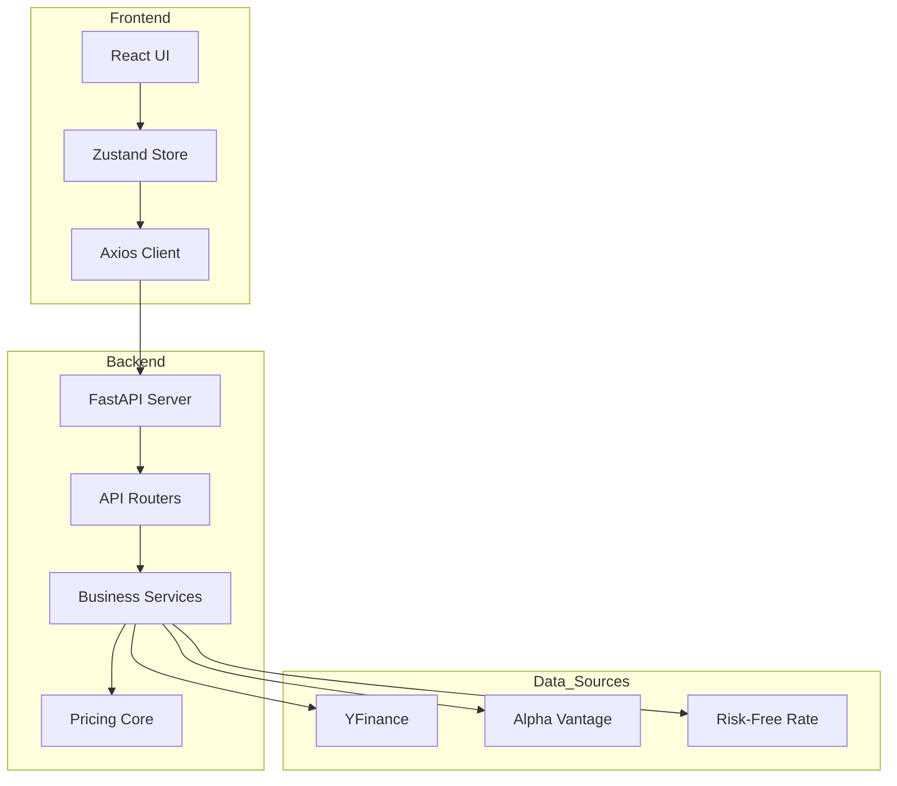

## Overview

OptionStrat AI follows a modern **three-tier architecture** with clear separation between presentation, business logic, and data layers. The system is designed for real-time options pricing, multi-model strategy simulation, and AI-powered insights.

## Architecture Diagram



## Frontend Architecture

### State Management

The application uses **Zustand** for centralized state management with debounced calculations to optimize performance.

**Key Store Implementation** (`frontend/src/store/strategyStore.js:1-195`):

<Accordion title="View Complete Store Implementation">

```javascript
import { create } from 'zustand';
import api from '../api/client';

let _calcTimeout = null;
let _calcVersion = 0; // Lock anti-concurrencia

export const useStrategyStore = create((set, get) => ({
    // Estado Global
    ticker: '',
    spotPrice: 0,
    riskFreeRate: 0.05,
    
    // Expiraciones disponibles
    allExpirations: [],
    selectedExpiration: '',
    
    // Cadena de opciones para la expiración seleccionada
    optionChain: { calls: [], puts: [] },
    
    // Parámetros Interactivos del Heatmap
    volatilityShock: 0,
    daysToSimulate: 30,
    
    // Posiciones armadas por el usuario
    legs: [],
    
    // Resultados del Backend
    heatmapData: [],
    aiInsights: null,
    marketContext: null,
    
    // ... actions
}));
```

</Accordion>

### Concurrency Control

The store implements a **version-based concurrency lock** to handle rapid user interactions:

```javascript
_doCalculations: async () => {
    // Lock anti-concurrencia: invalidar cálculos anteriores
    const myVersion = ++_calcVersion;
    
    set({ isLoadingHeatmap: true });
    
    try {
        const [heatmapRes, greeksRes] = await Promise.all([
            api.post('/calculations/heatmap', payload),
            api.post('/ai/greeks', payload)
        ]);
        
        // Si ya hay un cálculo más nuevo, descartamos este
        if (_calcVersion !== myVersion) return;
        
        set({
            heatmapData: heatmapRes.data?.heatmap_grid,
            aiInsights: greeksRes.data
        });
    } catch (error) {
        console.error(error);
    }
}
```

<Note>
This pattern prevents race conditions when users rapidly adjust sliders or modify strategy legs.
</Note>

### Debounced Calculations

To optimize API calls during slider adjustments:

```javascript
_triggerCalcDebounced: () => {
    clearTimeout(_calcTimeout);
    _calcTimeout = setTimeout(() => {
        get()._doCalculations();
    }, 400); // 400ms debounce
}
```

## Backend Architecture

### FastAPI Application Structure

The backend (`backend/app/main.py:1-35`) follows a modular router-based design:

```python
from fastapi import FastAPI
from fastapi.middleware.cors import CORSMiddleware

app = FastAPI(
    title="OptionStrat API",
    description="Backend para el simulador inteligente de opciones financieras",
    version="1.0.0"
)

app.add_middleware(
    CORSMiddleware,
    allow_origins=["*"],
    allow_credentials=True,
    allow_methods=["*"],
    allow_headers=["*"],
)

from app.api.routers import option_chains, calculations, ai_insights, recommender, market

app.include_router(option_chains.router, prefix="/api")
app.include_router(calculations.router, prefix="/api")
app.include_router(ai_insights.router, prefix="/api")
app.include_router(recommender.router, prefix="/api")
app.include_router(market.router, prefix="/api")
```

### API Router Structure

<Tabs>
  <Tab title="Calculations Router">
    The core calculation endpoint (`backend/app/api/routers/calculations.py:10-34`):
    
    ```python
    @router.post("/heatmap", response_model=HeatmapResponse)
    async def generate_advanced_heatmap(state: StrategyState):
        """
        Ruta PRINCIPAL (Estrella) de OptionStrat.
        Recibe un estado base (la estrategia del usuario en React).
        Genera un grid numérico 2D cruzando iteraciones de tiempo y de 
        precio subyacente consumiendo Black Scholes.
        """
        try:
            result = StrategyBuilder.generate_heatmap_grid(state)
            
            return {
                "status": "success",
                "max_profit": result["max_profit"],
                "max_loss": result["max_loss"],
                "heatmap_grid": result["heatmap_grid"]
            }
        except Exception as e:
            logging.error(f"Error calculating Heatmap: {e}")
            return {"status": "error", "heatmap_grid": []}
    ```
  </Tab>
  
  <Tab title="Option Chains Router">
    Handles market data fetching:
    
    - `GET /options/expirations/{ticker}` - List available expiration dates
    - `GET /options/chain/{ticker}` - Get option chain for specific expiration
    - Uses `OptionsDataManager` for data retrieval
  </Tab>
  
  <Tab title="AI Insights Router">
    Provides intelligent analysis:
    
    - `POST /ai/greeks` - Fast Greeks calculation and interpretation
    - `POST /ai/insights` - Deep LLM-powered strategy analysis
    - Integrates with OpenAI/Anthropic APIs
  </Tab>
</Tabs>

## Data Layer Architecture

### Multi-Source Data Strategy

The system implements a **hybrid data fetching strategy** prioritizing quality and availability:

```python
class OptionsDataManager:
    """
    Gestor de datos de Opciones (YFinance + Alpha Vantage).
    Encargado de descargar cadenas de opciones, precios spot y 
    manejar Rate Limits.
    """
    
    def __init__(self, delay: float = 1.5):
        self.delay = delay
        self.av_api_key = os.getenv("ALPHA_VANTAGE_KEY")
        self.av_client = AVOptions(key=self.av_api_key) if self.av_api_key else None
```

<Accordion title="Data Source Priority Logic">

From `backend/app/data/data_manager.py:239-271`:

```python
def get_full_option_chain(self, ticker: str, min_days: int = 20, 
                          max_days: int = 60) -> pd.DataFrame:
    """
    Descarga la cadena de opciones completa.
    Prioridad: Alpha Vantage (Rico en Griegas) -> YFinance (Rápido)
    """
    
    # 1. Intentar Alpha Vantage PRIMERO (Mejores Griegas)
    df_av = pd.DataFrame()
    if self.av_client:
        logger.info(f"{ticker}: Intentando Alpha Vantage...")
        df_av = self._fetch_options_av(ticker)
    
    # Si AV funciona y tiene griegas, usarlo
    if not df_av.empty and "delta" in df_av.columns:
        logger.info(f"{ticker}: Usando Alpha Vantage ({len(df_av)} opciones).")
        
        # Filtrar por DTE
        curr_time = pd.Timestamp.now()
        df_av['dte'] = (df_av['expirationDate'] - curr_time).dt.days
        df_av = df_av[(df_av['dte'] >= min_days) & (df_av['dte'] <= max_days)]
        
        return df_av
    
    # 2. Fallback a YFinance
    logger.info(f"{ticker}: Usando YFinance (Alpha Vantage falló)...")
    # ... YFinance implementation
```

</Accordion>

### Rate Limit Protection

The data manager implements exponential backoff and circuit breaking:

```python
def _safe_request(self, func, *args, **kwargs):
    """Envoltorio para manejar Rate Limits y pausas."""
    time.sleep(self.delay)
    try:
        return func(*args, **kwargs)
    except Exception as e:
        msg = str(e)
        if "Too Many Requests" in msg or "429" in msg:
            logger.critical(f"RATE LIMIT (429) detectado. Deteniendo.")
            raise ConnectionError("RATE_LIMIT_HIT")
        raise e
```

<Warning>
When rate limits are hit, the system raises a `RATE_LIMIT_HIT` exception that propagates to the frontend, preventing further API abuse.
</Warning>

## Core Pricing Engine

### Module Architecture

The pricing core is split into specialized modules:

```
backend/app/core/
├── black_scholes.py      # BSM, Binomial, Trinomial models
├── monte_carlo.py        # Monte Carlo simulation & IV analysis
└── strategy_builder.py   # Multi-leg strategy composition
```

### Greeks Calculation Pipeline

From `backend/app/data/data_manager.py:361-412`, the system automatically calculates Greeks when missing:

```python
# FORZAR CALCULO: yfinance trae griegas malas o incompletas
need_calc = True

if need_calc:
    deltas, gammas, thetas, vegas = [], [], [], []
    
    for idx, row in df.iterrows():
        try:
            T_years = max(row['dte'], 0.5) / 365.0
            sigma = row['impliedVolatility']
            
            if sigma <= 0 or T_years <= 0:
                deltas.append(0.0); gammas.append(0.0)
                thetas.append(0.0); vegas.append(0.0)
                continue
            
            greeks = bsm_greeks(
                S=spot, 
                K=row['strike'], 
                T=T_years, 
                r=r, 
                sigma=sigma, 
                q=0.0,
                kind=row['type']
            )
            
            deltas.append(greeks.get('delta', 0.0))
            gammas.append(greeks.get('gamma', 0.0))
            thetas.append(greeks.get('theta', 0.0))
            vegas.append(greeks.get('vega', 0.0))
        except Exception:
            deltas.append(0.0); gammas.append(0.0)
            thetas.append(0.0); vegas.append(0.0)
    
    df['delta'] = deltas
    df['gamma'] = gammas
    df['theta'] = thetas
    df['vega'] = vegas
```

<Note>
The system recalculates all Greeks using the BSM model with current risk-free rates, ensuring consistency across the platform.
</Note>

## Performance Optimizations

### 1. Parallel API Calls

The frontend makes parallel requests for independent data:

```javascript
const [heatmapRes, greeksRes] = await Promise.all([
    api.post('/calculations/heatmap', payload),
    api.post('/ai/greeks', payload)
]);
```

### 2. Lazy Loading Strategy

Option chains are loaded on-demand per expiration:

```javascript
fetchExpirations: async (sym) => {
    // Load expirations list (fast)
    const res = await api.get(`/options/expirations/${sym}`);
    
    // Auto-load first expiration chain
    if (firstExp) {
        get().fetchChainForExpiration(sym, firstExp);
    }
    
    // Fetch market context asynchronously (non-blocking)
    get().fetchMarketContext(sym);
}
```

### 3. Vectorized Calculations

NumPy arrays are used for efficient pricing computations (see [Pricing Models](/technical/pricing-models)).

## Security Considerations

<Warning>
**Production Deployment Requirements:**

1. **CORS**: Replace `allow_origins=["*"]` with specific domains
2. **API Keys**: Store in environment variables, never commit to repository
3. **Rate Limiting**: Implement Redis-based rate limiting for production
4. **Input Validation**: Use Pydantic models for all API inputs
5. **Error Handling**: Avoid exposing stack traces to clients
</Warning>

## Scalability Patterns

### Horizontal Scaling

The stateless API design allows for horizontal scaling:

```yaml
# Example Kubernetes deployment
apiVersion: apps/v1
kind: Deployment
metadata:
  name: optionstrat-api
spec:
  replicas: 3
  template:
    spec:
      containers:
      - name: api
        image: optionstrat-backend:latest
        resources:
          requests:
            memory: "512Mi"
            cpu: "500m"
```

### Caching Strategy

<Accordion title="Recommended Caching Layers">

1. **Spot Price Cache**: Cache spot prices for 5 seconds
2. **Risk-Free Rate Cache**: Cache ^IRX data for 1 hour
3. **Option Chain Cache**: Cache chains for 1 minute during market hours
4. **Greeks Cache**: Cache calculated Greeks keyed by (S, K, T, σ, r)

```python
# Example Redis caching
import redis
from functools import wraps

def cache_greeks(ttl=60):
    def decorator(func):
        @wraps(func)
        def wrapper(S, K, T, r, sigma, q, kind):
            key = f"greeks:{S}:{K}:{T}:{r}:{sigma}:{q}:{kind}"
            cached = redis_client.get(key)
            if cached:
                return json.loads(cached)
            
            result = func(S, K, T, r, sigma, q, kind)
            redis_client.setex(key, ttl, json.dumps(result))
            return result
        return wrapper
    return decorator
```

</Accordion>

## Development Workflow

### Local Development Setup

```bash
# Backend
cd backend
python -m venv venv
source venv/bin/activate
pip install -r requirements.txt
uvicorn app.main:app --reload --port 8000

# Frontend
cd frontend
npm install
npm run dev
```

### Environment Variables

```bash
# .env file
ALPHA_VANTAGE_KEY=your_key_here
OPENAI_API_KEY=your_key_here
ANTHROPIC_API_KEY=your_key_here
```

## Technology Stack Summary

| Layer | Technology | Purpose |
|-------|------------|----------|
| Frontend | React 18 | UI Components |
| State Management | Zustand | Global State |
| HTTP Client | Axios | API Communication |
| Backend Framework | FastAPI | REST API Server |
| Pricing Engine | NumPy + SciPy | Mathematical Computations |
| Data Sources | YFinance, Alpha Vantage | Market Data |
| LLM Integration | OpenAI, Anthropic | AI Insights |
| Data Processing | Pandas | Data Manipulation |

## Next Steps

<CardGroup cols={2}>
  <Card title="Pricing Models" icon="calculator" href="/technical/pricing-models">
    Deep dive into Black-Scholes, Binomial, and Monte Carlo implementations
  </Card>
  <Card title="Data Sources" icon="database" href="/technical/data-sources">
    Learn about market data integration and real-time pricing
  </Card>
</CardGroup>