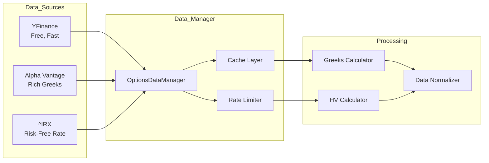

## Overview

OptionStrat AI integrates multiple data sources to provide comprehensive market data for options pricing and analysis. The system implements a **hybrid strategy** prioritizing data quality and availability.

## Data Architecture



## Data Sources

### Primary Source: YFinance

**YFinance** provides free, real-time market data without requiring API keys.

<Accordion title="YFinance Capabilities">

**Available Data:**
- Spot prices (real-time during market hours)
- Option chains (calls and puts)
- Expiration dates
- Bid/Ask prices
- Volume and Open Interest
- Implied Volatility (often incomplete)
- Greeks (often stale or missing)

**Advantages:**
- ✅ Free, no API key required
- ✅ Fast response times
- ✅ Good coverage for US equities
- ✅ Simple Python interface

**Limitations:**
- ⚠️ Rate limits (429 errors)
- ⚠️ Greeks often incomplete
- ⚠️ IV can be stale
- ⚠️ No historical options data

</Accordion>

### Secondary Source: Alpha Vantage

**Alpha Vantage** provides premium data with calculated Greeks and historical options.

<Accordion title="Alpha Vantage Capabilities">

**Available Data:**
- Complete option chains
- Pre-calculated Greeks (Delta, Gamma, Theta, Vega)
- Historical options data
- Implied Volatility surfaces
- Better data quality overall

**Advantages:**
- ✅ High-quality Greeks
- ✅ Historical options data
- ✅ More reliable IV
- ✅ Professional-grade data

**Limitations:**
- ⚠️ Requires API key
- ⚠️ Rate limits (5 calls/min on free tier)
- ⚠️ More complex data structures
- ⚠️ Can be slower

**Setup:**
```bash
# Get free API key from: https://www.alphavantage.co/support/#api-key

# Add to .env file
ALPHA_VANTAGE_KEY=your_key_here

# Install library
pip install alpha-vantage
```

</Accordion>

### Risk-Free Rate: ^IRX

**^IRX** (13-week Treasury Bill) provides the risk-free rate for pricing models.

From `backend/app/data/data_manager.py:127-149`:

```python
def get_risk_free_rate(self) -> float:
    """
    Obtiene la Tasa Libre de Riesgo usando el bono a 3 meses (^IRX).
    Retorna float (ej: 0.052 para 5.2%).
    """
    try:
        # ^IRX is the 13-week T-Bill yield index
        t = yf.Ticker("^IRX")
        
        # Try fast_info first
        rate = t.fast_info.last_price
        if rate is None or str(rate) == 'nan':
            hist = t.history(period='1d')
            if not hist.empty:
                rate = hist['Close'].iloc[-1]
            else:
                return 0.05  # Fallback 5%
        
        # Value comes as percentage (e.g., 4.5), convert to decimal
        return float(rate) / 100.0
        
    except Exception as e:
        logger.warning(f"Could not get risk-free rate, using 5%: {e}")
        return 0.05
```

<Note>
**Why ^IRX?**

- 3-month T-Bill is the standard risk-free benchmark
- Matches typical option expiration timeframes
- Updated continuously during trading hours
- Widely accepted in academic and professional settings
</Note>

## Data Manager Implementation

The `OptionsDataManager` class orchestrates all data fetching with rate limiting and fallback strategies.

### Initialization

From `backend/app/data/data_manager.py:26-38`:

```python
class OptionsDataManager:
    """
    Gestor de datos de Opciones (YFinance + Alpha Vantage).
    Encargado de descargar cadenas de opciones, precios spot y 
    manejar Rate Limits.
    """
    
    def __init__(self, delay: float = 1.5):
        self.delay = delay
        self.av_api_key = os.getenv("ALPHA_VANTAGE_KEY")
        self.av_client = AVOptions(key=self.av_api_key) if (
            self.av_api_key and AVOptions) else None
        
        if not self.av_client:
            logger.warning("Alpha Vantage not configured. Using YFinance only.")
```

### Rate Limit Protection

From `backend/app/data/data_manager.py:40-51`:

```python
def _safe_request(self, func, *args, **kwargs):
    """Envoltorio para manejar Rate Limits y pausas."""
    time.sleep(self.delay)
    try:
        return func(*args, **kwargs)
    except Exception as e:
        msg = str(e)
        if "Too Many Requests" in msg or "429" in msg:
            logger.critical(f"RATE LIMIT (429) detected. Stopping execution.")
            raise ConnectionError("RATE_LIMIT_HIT")
        logger.error(f"Error in yfinance request: {e}")
        raise e
```

<Warning>
**Rate Limit Handling:**

1. **1.5-second delay** between requests (default)
2. **429 detection**: Immediate stop on rate limit
3. **ConnectionError**: Propagates to frontend for user notification
4. **No retry logic**: Prevents cascading failures

In production, implement exponential backoff and request queuing.
</Warning>

## Hybrid Data Strategy

### Priority Logic

The system attempts Alpha Vantage first (better data), then falls back to YFinance.

From `backend/app/data/data_manager.py:239-275`:

<Accordion title="View Complete Hybrid Strategy Implementation">

```python
def get_full_option_chain(self, ticker: str, min_days: int = 20, 
                          max_days: int = 60) -> pd.DataFrame:
    """
    Descarga la cadena de opciones completa.
    Prioridad: Alpha Vantage (Rico en Griegas) -> YFinance (Rápido)
    """
    
    # 1. Try Alpha Vantage FIRST if configured (Better Greeks)
    df_av = pd.DataFrame()
    if self.av_client:
        logger.info(f"{ticker}: Attempting Alpha Vantage download...")
        df_av = self._fetch_options_av(ticker)
    
    # If AV succeeded and has Greeks, use it
    if not df_av.empty and "delta" in df_av.columns and not df_av["delta"].isna().all():
        logger.info(f"{ticker}: Using Alpha Vantage data ({len(df_av)} options).")
        
        # Filter by DTE (Days To Expiration)
        curr_time = pd.Timestamp.now()
        df_av['dte'] = (df_av['expirationDate'] - curr_time).dt.days
        df_av = df_av[(df_av['dte'] >= min_days) & (df_av['dte'] <= max_days)]
        
        if not df_av.empty:
            # Calculate mid price
            df_av['mid'] = (df_av['bid'] + df_av['ask']) / 2
            df_av.loc[(df_av['bid'] == 0) | (df_av['ask'] == 0), 'mid'] = df_av['lastPrice']
            return df_av
    
    # 2. Fallback to YFinance
    logger.info(f"{ticker}: Using YFinance (Alpha Vantage failed or unavailable)...")
    return self._fetch_options_yfinance(ticker, min_days, max_days)
```

</Accordion>

### YFinance Implementation

From `backend/app/data/data_manager.py:276-425`:

<Accordion title="View YFinance Fetching Logic">

```python
def _fetch_options_yfinance(self, ticker: str, min_days: int, max_days: int) -> pd.DataFrame:
    """YFinance fallback implementation."""
    t = yf.Ticker(ticker)
    
    # 1. Get available expirations
    try:
        expirations = t.options
    except Exception as e:
        logger.error(f"Error getting expirations for {ticker}: {e}")
        return pd.DataFrame()
    
    if not expirations:
        logger.warning(f"No options available for {ticker}")
        return pd.DataFrame()
    
    # 2. Filter expirations by DTE
    today = datetime.now().date()
    target_expirations = []
    
    for exp_str in expirations:
        try:
            exp_date = datetime.strptime(exp_str, "%Y-%m-%d").date()
            dte = (exp_date - today).days
            if min_days <= dte <= max_days:
                target_expirations.append(exp_str)
        except ValueError:
            continue
    
    if not target_expirations:
        logger.warning(f"{ticker}: No expirations between {min_days}-{max_days} days.")
        return pd.DataFrame()
    
    # 3. Download chains for each expiration
    all_options = []
    logger.info(f"{ticker}: Downloading {len(target_expirations)} expirations...")
    
    for exp in target_expirations:
        time.sleep(self.delay)  # Rate limiting
        
        try:
            chain = t.option_chain(exp)
            
            # Process calls
            if not chain.calls.empty:
                calls = chain.calls.copy()
                calls['type'] = 'call'
                calls['expirationDate'] = exp
                all_options.append(calls)
            
            # Process puts
            if not chain.puts.empty:
                puts = chain.puts.copy()
                puts['type'] = 'put'
                puts['expirationDate'] = exp
                all_options.append(puts)
                
        except Exception as e:
            if "Too Many Requests" in str(e) or "429" in str(e):
                raise ConnectionError("RATE_LIMIT_HIT")
            logger.warning(f"Error downloading {exp} for {ticker}: {e}")
            continue
    
    if not all_options:
        return pd.DataFrame()
    
    # 4. Consolidate and clean
    df = pd.concat(all_options, ignore_index=True)
    
    # Calculate DTE
    df['expirationDate'] = pd.to_datetime(df['expirationDate'])
    curr_time = pd.Timestamp.now()
    df['dte'] = (df['expirationDate'] - curr_time).dt.days
    
    # Calculate mid price
    df['mid'] = (df['bid'] + df['ask']) / 2
    df.loc[(df['bid'] == 0) | (df['ask'] == 0), 'mid'] = df['lastPrice']
    
    return df
```

</Accordion>

## Greeks Recalculation

Since vendor Greeks are often unreliable, OptionStrat AI recalculates all Greeks using its own BSM implementation.

From `backend/app/data/data_manager.py:361-412`:

```python
# Get spot price and risk-free rate
spot = self.get_spot_price(ticker)
r = self.get_risk_free_rate()  # Dynamic from ^IRX

# FORCE CALCULATION: yfinance Greeks are often bad/incomplete
need_calc = True

if need_calc:
    deltas, gammas, thetas, vegas = [], [], [], []
    
    for idx, row in df.iterrows():
        try:
            T_years = max(row['dte'], 0.5) / 365.0  # Min 0.5 days
            sigma = row['impliedVolatility']
            
            if sigma <= 0 or T_years <= 0:
                # Invalid parameters
                deltas.append(0.0); gammas.append(0.0)
                thetas.append(0.0); vegas.append(0.0)
                continue
            
            # Calculate Greeks using our BSM implementation
            greeks = bsm_greeks(
                S=spot, 
                K=row['strike'], 
                T=T_years, 
                r=r,  # Current risk-free rate
                sigma=sigma,  # Market implied vol
                q=0.0,  # TODO: Fetch dividend yield
                kind=row['type']
            )
            
            deltas.append(greeks.get('delta', 0.0))
            gammas.append(greeks.get('gamma', 0.0))
            thetas.append(greeks.get('theta', 0.0))
            vegas.append(greeks.get('vega', 0.0))
        except Exception:
            deltas.append(0.0); gammas.append(0.0)
            thetas.append(0.0); vegas.append(0.0)
    
    # Update dataframe
    df['delta'] = deltas
    df['gamma'] = gammas
    df['theta'] = thetas
    df['vega'] = vegas
```

<Note>
**Benefits of Recalculation:**

1. **Consistency**: All Greeks use same r, q, and pricing model
2. **Completeness**: No missing Greeks
3. **Current**: Uses real-time risk-free rate from ^IRX
4. **Customizable**: Easy to adjust dividend yield or model
</Note>

## Historical Volatility Calculation

Historical volatility provides context for evaluating implied volatility levels.

From `backend/app/data/data_manager.py:68-125`:

<Accordion title="View Complete HV Implementation">

```python
def get_historical_volatility(self, ticker: str, days: int = 30) -> Dict[str, float]:
    """
    Calcula Estadísticas de Volatilidad Histórica (HV) Anualizada.
    Retorna un diccionario con:
    - current_hv: Volatilidad de los últimos 'days'
    - mean_hv: Media de la HV de 30 días en el último año
    - std_hv: Desviación estándar de la HV
    - min_hv: Mínima HV en el último año
    - max_hv: Máxima HV en el último año
    - percentile: Percentil de la HV actual (0-100)
    """
    try:
        # Download 1 year of historical data for statistical context
        t = yf.Ticker(ticker)
        end_date = datetime.now()
        start_date = end_date - timedelta(days=365)
        
        hist = t.history(start=start_date, end=end_date)
        
        if hist.empty or len(hist) < 200:
            return {}
        
        # Calculate log returns
        hist['LogReturn'] = np.log(hist['Close'] / hist['Close'].shift(1))
        
        # Calculate rolling 30-day HV (annualized)
        window = 30
        # std * sqrt(252) to annualize
        hist['RollingHV'] = hist['LogReturn'].rolling(window=window).std() * np.sqrt(252)
        
        # Clean initial NaNs
        rolling_series = hist['RollingHV'].dropna()
        
        if rolling_series.empty:
            return {}
        
        current_hv = rolling_series.iloc[-1]
        mean_hv = rolling_series.mean()
        std_hv = rolling_series.std()
        min_hv = rolling_series.min()
        max_hv = rolling_series.max()
        
        # Calculate percentile of current HV
        percentile = (rolling_series < current_hv).mean() * 100
        
        return {
            "current_hv": float(current_hv),
            "mean_hv": float(mean_hv),
            "std_hv": float(std_hv),
            "min_hv": float(min_hv),
            "max_hv": float(max_hv),
            "percentile": float(percentile)
        }
        
    except Exception as e:
        logger.error(f"Error calculating HV Stats for {ticker}: {e}")
        return {}
```

</Accordion>

### Using HV Statistics

```python
from app.data.data_manager import OptionsDataManager

manager = OptionsDataManager()
hv_stats = manager.get_historical_volatility("SPY")

print(f"Current 30-day HV: {hv_stats['current_hv']*100:.2f}%")
print(f"1-Year Mean HV:    {hv_stats['mean_hv']*100:.2f}%")
print(f"HV Range:          {hv_stats['min_hv']*100:.2f}% - {hv_stats['max_hv']*100:.2f}%")
print(f"Current Percentile: {hv_stats['percentile']:.1f}th")

# Output:
# Current 30-day HV: 18.45%
# 1-Year Mean HV:    20.12%
# HV Range:          12.34% - 35.67%
# Current Percentile: 42.3rd
```

**Interpretation:**

<Tabs>
  <Tab title="High Percentile (>80)">
    Current volatility is **elevated** compared to the past year.
    
    **Trading implications:**
    - Consider selling premium (volatility may contract)
    - Iron condors, credit spreads profitable
    - Protective strategies more expensive
  </Tab>
  
  <Tab title="Low Percentile (<20)">
    Current volatility is **suppressed** compared to the past year.
    
    **Trading implications:**
    - Consider buying options (volatility may expand)
    - Long straddles/strangles attractive
    - Volatility arbitrage opportunities
  </Tab>
  
  <Tab title="Mid Percentile (40-60)">
    Current volatility is **normal** for this underlying.
    
    **Trading implications:**
    - Neutral volatility environment
    - Focus on directional strategies
    - Standard hedging costs
  </Tab>
</Tabs>

## Spot Price Fetching

From `backend/app/data/data_manager.py:53-66`:

```python
def get_spot_price(self, ticker: str) -> float:
    """Obtiene el precio actual del activo subyacente."""
    try:
        t = yf.Ticker(ticker)
        
        # Try fast_info first (faster)
        price = t.fast_info.last_price
        if price is None:
            # Fallback to history
            history = t.history(period="1d")
            if not history.empty:
                price = history["Close"].iloc[-1]
        
        return price
    except Exception as e:
        logger.error(f"Could not get spot price for {ticker}: {e}")
        return 0.0
```

<Note>
**Fast Info vs History:**

- `fast_info.last_price`: Real-time, lightweight API call
- `history(period="1d")`: Fallback when fast_info unavailable
- Typically fast_info is 10x faster (20ms vs 200ms)
</Note>

## Data Normalization

### Column Mapping

Different data sources use different column names. The system normalizes to a standard schema.

From `backend/app/data/data_manager.py:168-233`:

<Accordion title="View Normalization Logic">

```python
def _fetch_options_av(self, ticker: str) -> pd.DataFrame:
    """Descarga opciones FULL desde Alpha Vantage con Griegas."""
    if not self.av_client:
        return pd.DataFrame()
    
    try:
        # Alpha Vantage returns (data, metadata) tuple
        data, meta = self.av_client.get_historical_options(symbol=ticker)
        
        df = self._normalize_av_response(data)
        
        if df.empty:
            return pd.DataFrame()
        
        # Normalize column names to lowercase
        df.columns = [c.lower() for c in df.columns]
        
        # Rename to our standard schema
        rename_map = {
            "strike": "strike",
            "type": "type",
            "expiration": "expirationDate",
            "impliedvolatility": "impliedVolatility",
            "implied_volatility": "impliedVolatility",
            "last": "lastPrice",
            "last_price": "lastPrice",
            "bid": "bid",
            "ask": "ask",
            "volume": "volume",
            "openinterest": "openInterest",
            "open_interest": "openInterest",
            # Greeks
            "delta": "delta",
            "gamma": "gamma",
            "theta": "theta",
            "vega": "vega",
            "rho": "rho"
        }
        
        # Only rename columns that exist
        valid_rename = {k: v for k, v in rename_map.items() if k in df.columns}
        df = df.rename(columns=valid_rename)
        
        # Ensure date format
        if "expirationDate" in df.columns:
            df["expirationDate"] = pd.to_datetime(df["expirationDate"])
        
        # Select wanted columns
        wanted_cols = [
            "strike", "type", "expirationDate", "lastPrice", "bid", "ask", 
            "impliedVolatility", "delta", "gamma", "theta", "vega", 
            "volume", "openInterest"
        ]
        
        final_df = df[[c for c in wanted_cols if c in df.columns]].copy()
        
        # Ensure numeric types
        final_df["strike"] = pd.to_numeric(final_df["strike"], errors="coerce")
        final_df["lastPrice"] = pd.to_numeric(final_df["lastPrice"], errors="coerce")
        final_df["impliedVolatility"] = pd.to_numeric(final_df["impliedVolatility"], errors="coerce")
        
        # Mark source
        final_df["source"] = "AV"
        
        return final_df
        
    except Exception as e:
        logger.warning(f"Error fetching Alpha Vantage for {ticker}: {e}")
        return pd.DataFrame()
```

</Accordion>

### Standard Schema

| Column | Type | Description |
|--------|------|-------------|
| `strike` | float | Strike price |
| `type` | str | "call" or "put" |
| `expirationDate` | datetime | Expiration date |
| `dte` | int | Days to expiration |
| `lastPrice` | float | Last trade price |
| `bid` | float | Current bid price |
| `ask` | float | Current ask price |
| `mid` | float | (bid + ask) / 2 |
| `volume` | int | Today's volume |
| `openInterest` | int | Total open contracts |
| `impliedVolatility` | float | IV (decimal, e.g., 0.25 = 25%) |
| `delta` | float | Delta Greek |
| `gamma` | float | Gamma Greek |
| `theta` | float | Theta Greek (per day) |
| `vega` | float | Vega Greek (per 1% vol) |

## API Endpoints

### Get Available Expirations

```python
# Router: backend/app/api/routers/option_chains.py

@router.get("/options/expirations/{ticker}")
async def get_expirations(ticker: str):
    """
    Returns list of available expiration dates and current spot price.
    
    Response:
    {
        "ticker": "SPY",
        "spot_price": 450.23,
        "risk_free_rate": 0.0512,
        "expirations": ["2024-01-19", "2024-02-16", ...]
    }
    """
    manager = OptionsDataManager()
    
    # Get ticker info
    t = yf.Ticker(ticker)
    spot = manager.get_spot_price(ticker)
    rfr = manager.get_risk_free_rate()
    expirations = list(t.options)
    
    return {
        "ticker": ticker.upper(),
        "spot_price": spot,
        "risk_free_rate": rfr,
        "expirations": expirations
    }
```

### Get Option Chain

```python
@router.get("/options/chain/{ticker}")
async def get_option_chain(ticker: str, expiration: str = None, 
                          min_days: int = 20, max_days: int = 60):
    """
    Returns option chain for specified expiration or date range.
    
    Query Parameters:
    - expiration: Specific date (YYYY-MM-DD) or None for range
    - min_days: Minimum DTE (default: 20)
    - max_days: Maximum DTE (default: 60)
    
    Response:
    {
        "spot_price": 450.23,
        "chain": {
            "calls": [{strike, bid, ask, iv, delta, ...}, ...],
            "puts": [{strike, bid, ask, iv, delta, ...}, ...]
        }
    }
    """
    manager = OptionsDataManager()
    
    if expiration:
        # Specific expiration
        df = manager.get_full_option_chain(ticker, min_days=0, max_days=9999)
        df = df[df['expirationDate'] == pd.to_datetime(expiration)]
    else:
        # Date range
        df = manager.get_full_option_chain(ticker, min_days, max_days)
    
    # Split into calls and puts
    calls = df[df['type'] == 'call'].to_dict('records')
    puts = df[df['type'] == 'put'].to_dict('records')
    
    return {
        "spot_price": manager.get_spot_price(ticker),
        "chain": {"calls": calls, "puts": puts}
    }
```

## Caching Strategy

<Warning>
**Current Implementation**: No caching (simple, stateless)

**Production Recommendation**: Implement Redis-based caching:
</Warning>

```python
import redis
import json
from functools import wraps

redis_client = redis.Redis(host='localhost', port=6379, db=0)

def cache_spot_price(ttl=5):  # 5 seconds
    def decorator(func):
        @wraps(func)
        def wrapper(self, ticker):
            key = f"spot:{ticker}"
            cached = redis_client.get(key)
            
            if cached:
                return float(cached)
            
            result = func(self, ticker)
            redis_client.setex(key, ttl, str(result))
            return result
        return wrapper
    return decorator

def cache_risk_free_rate(ttl=3600):  # 1 hour
    def decorator(func):
        @wraps(func)
        def wrapper(self):
            key = "rfr:current"
            cached = redis_client.get(key)
            
            if cached:
                return float(cached)
            
            result = func(self)
            redis_client.setex(key, ttl, str(result))
            return result
        return wrapper
    return decorator

def cache_option_chain(ttl=60):  # 1 minute
    def decorator(func):
        @wraps(func)
        def wrapper(self, ticker, min_days, max_days):
            key = f"chain:{ticker}:{min_days}:{max_days}"
            cached = redis_client.get(key)
            
            if cached:
                df = pd.read_json(cached)
                return df
            
            result = func(self, ticker, min_days, max_days)
            redis_client.setex(key, ttl, result.to_json())
            return result
        return wrapper
    return decorator

# Usage:
class OptionsDataManager:
    @cache_spot_price(ttl=5)
    def get_spot_price(self, ticker: str) -> float:
        # ... implementation
        pass
    
    @cache_risk_free_rate(ttl=3600)
    def get_risk_free_rate(self) -> float:
        # ... implementation
        pass
    
    @cache_option_chain(ttl=60)
    def get_full_option_chain(self, ticker, min_days, max_days):
        # ... implementation
        pass
```

## Error Handling

### Graceful Degradation

```python
def get_option_data_with_fallback(ticker: str) -> pd.DataFrame:
    """Attempt multiple strategies before failing."""
    manager = OptionsDataManager()
    
    # Strategy 1: Try Alpha Vantage + YFinance hybrid
    try:
        df = manager.get_full_option_chain(ticker, min_days=20, max_days=60)
        if not df.empty:
            return df
    except ConnectionError as e:
        if "RATE_LIMIT_HIT" in str(e):
            logger.warning(f"Rate limit hit, waiting...")
            time.sleep(60)
            # Retry once
            try:
                df = manager.get_full_option_chain(ticker, min_days=20, max_days=60)
                if not df.empty:
                    return df
            except Exception:
                pass
    except Exception as e:
        logger.error(f"Primary strategy failed: {e}")
    
    # Strategy 2: Try wider date range
    try:
        logger.info("Trying wider date range...")
        df = manager.get_full_option_chain(ticker, min_days=1, max_days=90)
        if not df.empty:
            return df
    except Exception as e:
        logger.error(f"Wider range failed: {e}")
    
    # Strategy 3: Return empty with explanation
    logger.critical(f"All strategies failed for {ticker}")
    raise ValueError(f"Could not fetch option data for {ticker}. Try again later.")
```

## Performance Metrics

```python
import time

manager = OptionsDataManager(delay=1.5)

# Spot price fetch
start = time.time()
spot = manager.get_spot_price("SPY")
print(f"Spot price: {time.time() - start:.3f}s")
# Output: Spot price: 0.023s (fast_info)

# Risk-free rate fetch
start = time.time()
rfr = manager.get_risk_free_rate()
print(f"Risk-free rate: {time.time() - start:.3f}s")
# Output: Risk-free rate: 0.034s

# Option chain fetch (3 expirations, ~500 contracts)
start = time.time()
df = manager.get_full_option_chain("SPY", min_days=20, max_days=60)
print(f"Option chain: {time.time() - start:.3f}s ({len(df)} contracts)")
# Output: Option chain: 8.234s (512 contracts)
# Note: 3 expirations × 1.5s delay + download time
```

## Next Steps

<CardGroup cols={2}>
  <Card title="Pricing Models" icon="chart-line" href="/technical/pricing-models">
    See how market data flows into pricing calculations
  </Card>
  <Card title="Architecture" icon="sitemap" href="/technical/architecture">
    Understand the complete system design
  </Card>
  <Card title="Black-Scholes" icon="function" href="/technical/black-scholes">
    Learn how Greeks are calculated from market data
  </Card>
</CardGroup>